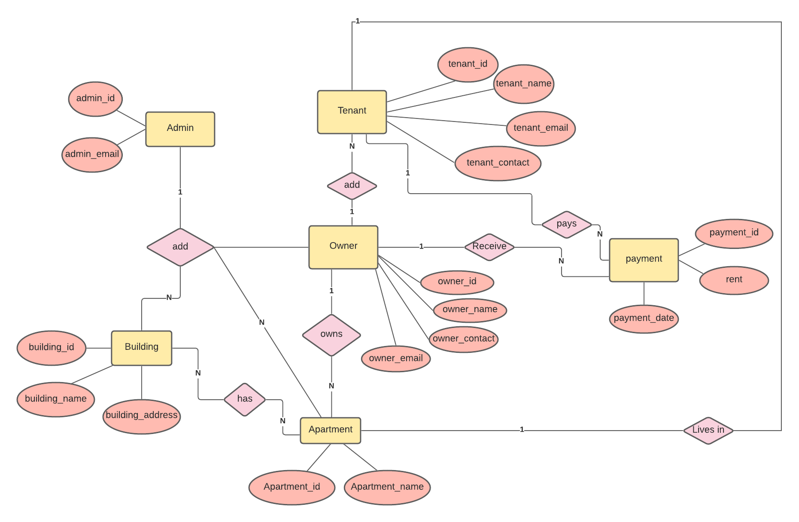

# Apartment-Management-System

Manage your apartment more efficiently. :houses:

Create 'apartmentdb' named database in phpMyAdmin
and import the .sql file into that.

email: admin@gmail.com
password:1234

# Apartment Management System (AMS)

AMS is a web-based application designed to manage apartment complexes efficiently. It facilitates tasks such as tenant management, rent collection, maintenance requests, and more. This system aims to streamline operations for property managers and provide a user-friendly interface for tenants.

## Features

- **User Roles:** Admin, Staff, and Tenants with different access levels.
- **Building and Apartment Management:** Add, update, and delete buildings and apartments.
- **Tenant Management:** Record tenant details, lease agreements, and rent payments.
- **Maintenance Requests:** Manage maintenance issues reported by tenants.
- **Reports and Analytics:** Generate reports on occupancy, rent collection, maintenance status, etc.

## Technologies Used

- **Frontend:** HTML, CSS, JavaScript, Bootstrap
- **Backend:** PHP, MySQL
- **Frameworks/Libraries:** jQuery, Bootstrap
- **Version Control:** Git, GitHub

## Installation

1. **Clone the repository:**

   ```bash
   git clone https://github.com/Vaidooryapadiyar2003/Apartment-Management-System-Dbms-.git
   cd Apartment-Management-System-Dbms-


## Here's The Entity Relation Diagram of our project :office:

